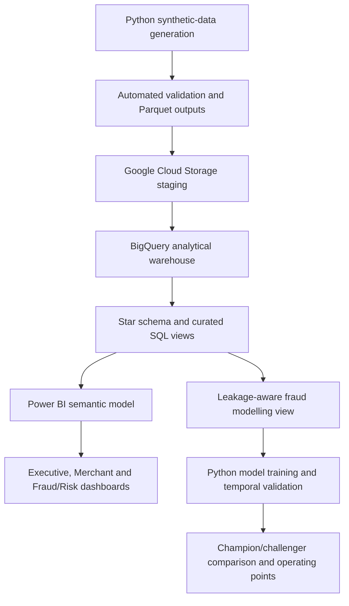
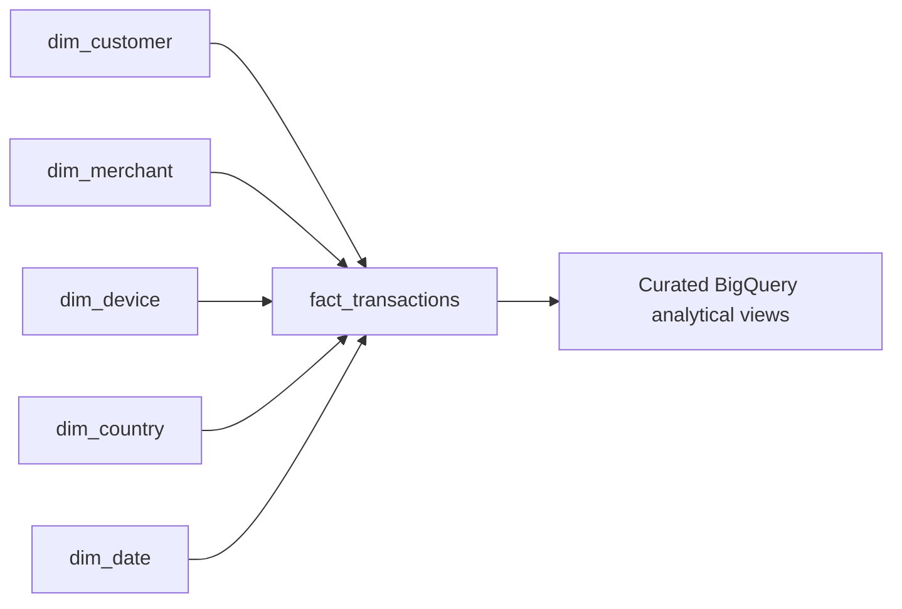

# Architecture

This folder documents the implemented architecture for the synthetic Global Payments Risk & Merchant Intelligence Platform.

> All data in this project is synthetic. The architecture is a portfolio implementation and is not affiliated with a real payment network or financial institution.

## End-to-End Flow

## Warehouse Model

The warehouse is centred on `fact_transactions` with reusable customer, merchant, device, country and date dimensions.

Detailed field definitions are maintained in [`docs/data_model.md`](../docs/data_model.md).

## Analytics Consumption

Power BI imports curated aggregate views rather than the full 5-million-row transaction fact. This keeps the semantic model compact while preserving BigQuery as the analytical source of truth.

The model layer separately consumes `vw_fraud_model_features`, which excludes post-outcome fields and high-cardinality entity identifiers. The modelling workflow uses January-October for training, November for validation and December as an untouched temporal test period.

## Design Principles

- reproducible synthetic data generation with a fixed seed
- validation before downstream consumption
- dimensional modelling and reusable SQL views
- separation of analytical reporting from model training
- leakage control for fraud-risk modelling
- compact Power BI inputs instead of importing the raw fact table
- explicit synthetic-data and non-production limitations
