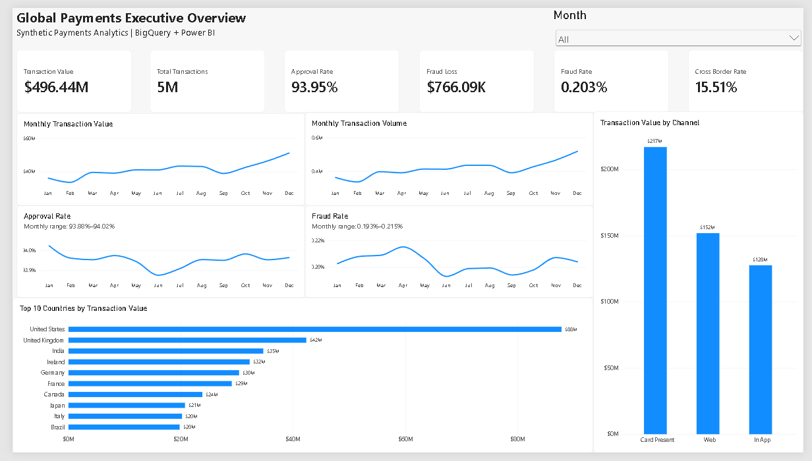
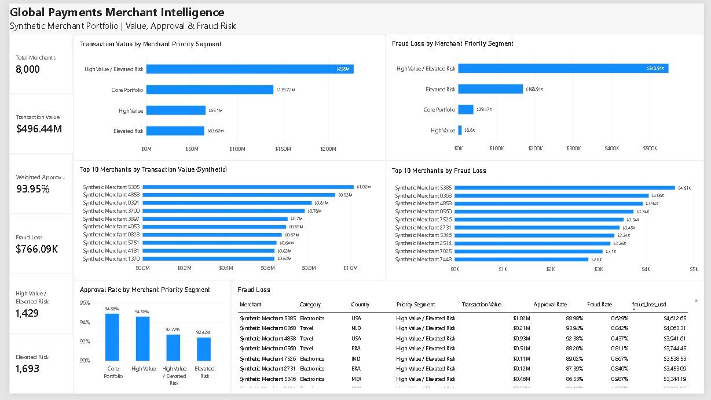
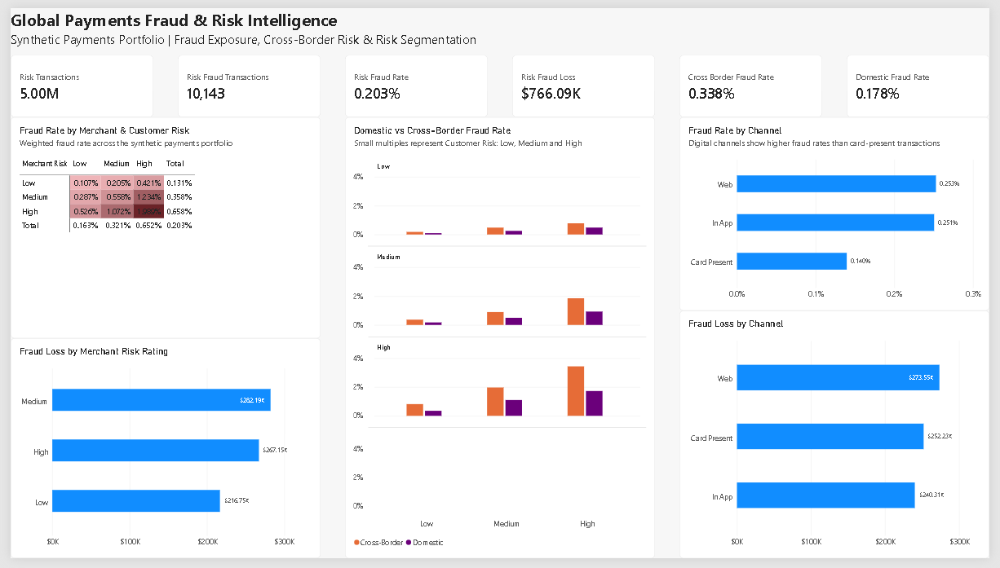

# Power BI Dashboard

The completed Power BI report is stored in this folder as [`global-payments-risk-intelligence-BI.pbix`](global-payments-risk-intelligence-BI.pbix).

The dashboard is built on the validated BigQuery analytical layer and presents the synthetic payments portfolio across three report pages.

## 1. Global Payments Executive Overview

Portfolio-level KPIs, monthly transaction value and volume trends, approval and fraud-rate trends, channel performance, and Top 10 countries by transaction value.

## 2. Global Payments Merchant Intelligence

Merchant value/risk segmentation, weighted approval performance, fraud-loss concentration, Top 10 synthetic merchants by transaction value and fraud loss, and a detailed merchant investigation table.

## 3. Global Payments Fraud & Risk Intelligence

Fraud exposure by merchant and customer risk, domestic versus cross-border fraud rates, merchant-risk fraud loss, channel fraud rates, and channel fraud loss.

## Validated Portfolio KPIs

- 5,000,000 synthetic transactions
- $496.44M transaction value
- 93.95% approval rate
- 0.203% fraud transaction rate
- $766.09K fraud loss
- 15.51% cross-border transaction rate

> All dashboard results are derived from the project's validated synthetic dataset and should not be interpreted as real payment-network or industry statistics.
